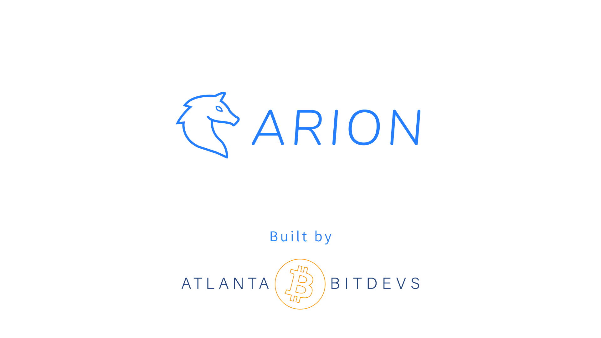

# Arion
_Parking at the speed of lightning ⚡️_

## Summary
Do you hate parking in Atlanta? You are not alone. Current parking solutions have a poor UX, require login, have limited payment options and parking duration options, and high minimum costs to consumers. Wouldn't it be great if you could park easily and simply via a clean UX, not requiring login and paying using the lightning network instantly from anywhere? Enter Arion, Parking at the Speed of Lightning ⚡️

### Live Demo

[ArionParking.tech](https://arionparking.tech)

This is a mainnet demo, so be cautious with your funds.

### UX/UI Design

[See Figma File](https://www.figma.com/file/uxLCmHch7dEqsnl6qElOOS/Atlanta-Lightning-Parking?node-id=0%3A1)

## Tech Stack
- Backend
  - Node.js
  - Express.js
  - Firebase / Firestore (noSQL document DB)
- Frontend
  - React / React-Scripts
  - Tailwind.css
  - Bitcoin Icons
- Lightning
  - OpenNode API

